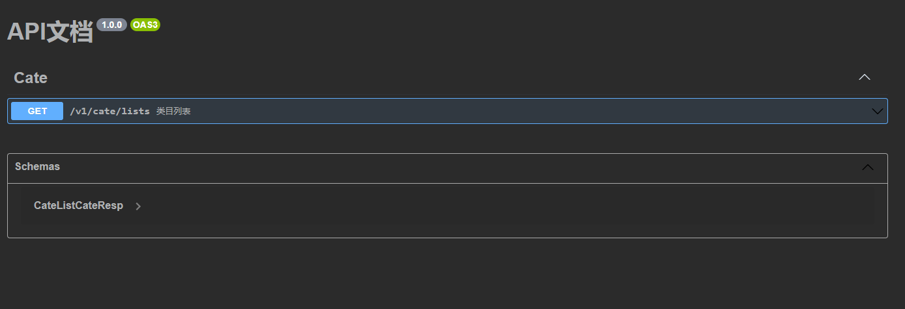

# API生成工具

这个组件主要是通过定义 api 文件来生成代码和API Swagger文档。

默认生成 应用服务层，接口层和领域层。

```
|- app/ 
    |- Application/  应用层
        |- Service/ 应用服务
            |- Contract/ 应用服务接口。用于依赖注入
    |- Interfaces/ 接口层
        |- Controller/ 接口(控制器)
        |- Desc/ api定义
        |- Types/ 请求体和响应体
    |- Domain/ 领域
        |- Xxx/ 某领域，根据api文件名生成领域名
            |- Service/ 领域服务
```

## 引入Composer包

```
composer require timebug/hyperf-apictl
```

## 配置

在 `config/autoload` 目录下新建 `apictl.php` 或者通过以下命令生成配置文件

```shell
php bin/hyperf.php vendor:publish timebug/hyperf-apictl
```

配置主要是定义代码生成的路径

```php
return [
    'pool' => 'default',
    'default' => [
        // 应用服务路径
        'service_path' => env('APICTL_SERVICE_PATH', '/app/Application/Service/'),
        // 应用服务接口路径
        'service_contract_path' => env('APICTL_SERVICE_CONTRACT_PATH', '/app/Application/Service/Contract'),
        // 领域路径
        'domain_path' => env('APICTL_DOMAIN_PATH', '/app/Domain'),
        // 控制器路径
        'controller_path' => env('APICTL_CONTROLLER_PATH', '/app/Interfaces/Controller'),
        // 请求响应体路径
        'type_path' => env('APICTL_TYPE_PATH', '/app/Interfaces/Types'),
        // API定义路径
        'api_path' => env('APICTL_API_PATH', '/app/Interfaces/Desc'),
        // API文档路径
        'swagger_name' => env('APICTL_SWAAGER_NAME', 'api.swaager.json'),
        // API文档请求头参数, 没有可不填
        'api_common_headers' => [
            [
                "name" => "appid",
                "in" => "header",
                "description" => "应用ID",
                "required" => true,
                "example" => "{{appid}}",
                "schema" => ["type" => "string"]
            ],
            [
                "name" => "nonce",
                "in" => "header",
                "description" => "随机字符串",
                "required" => true,
                "example" => "{{nonce}}",
                "schema" => ["type" => "string"]
            ],
            [
                "name" => "timestamp",
                "in" => "header",
                "description" => "当时时间戳",
                "required" => true,
                "example" => "{{timestamp}}",
                "schema" => ["type" => "integer"]
            ],
            [
                "name" => "signature",
                "in" => "header",
                "description" => "请求签名",
                "required" => true,
                "example" => "{{signature}}",
                "schema" => ["type" => "string"]
            ]
        ]
    ],
];
```

## 定义API文件

在 `app/Interfaces/Desc` 新建一个 api 文件，在 PHPStorm 的IDE可以安装 `goctl` 插件来支持api语法。

这里新建 `cate.api` 文件

```api
type (
    ListCateItem {
        id      int    `json:"id" desc:"类目ID"`
        title   string `json:"title" desc:"标题"`
        sort    int    `json:"sort" desc:"排序"`
        state   int    `json:"state" desc:"状态.1：启用;0：禁用."`
        addTime int    `json:"add_time" desc:"添加时间"`
    }
    ListCateReq {
        page   int   `json:"page" default:"1" desc:"页码"`
        size   int   `json:"size,optional" default:"10" desc:"页面大小"`
    }
    ListCateResp {
        total     int            `json:"total" desc:"总条数"`
        totalPage int            `json:"total_page" desc:"总页数"`
        size      int            `json:"size" desc:"当前页结果数量"`
        items     []ListCateItem `json:"items" desc:"类目"`
    }
)

@server(
    prefix: /v1/cate
    group: cate
)
service cate {

    @doc "类目列表"
    @handler lists
    get /lists (ListCateReq) returns (ListCateResp)
}
```

* [API 语法请参考](https://legacy.go-zero.dev/cn/api-grammar.html)

说明:
- 字段名(小驼峰): 字段名会是请求体或者响应体的属性名
- json: 注释里的json是映射字段，也就是实际请求或者响应对应的字段
- optional: 表明这个字段不是必要参数
- default: 定义默认值
- desc: 注释
- prefix: 这是会生成路由前缀

**注意:由于`json:"test" desc:"测试"`这里是通过空格进行分组，所以在desc中请不要出现空格，以及`:`，否则会出现格式错误**


# 生成API代码

```
# php bin/hyperf.php apictl:api --api=cate.api

create /var/www/code/app/Interfaces/Controller/CateController.php successfully.
create /var/www/code/app/Domain/Cate/Service/ListCateDomainService.php successfully.
create /var/www/code/app/Interfaces/Types/Cate/ListCateReq.php successfully.
create /var/www/code/app/Interfaces/Types/Cate/ListCateResp.php successfully.
create /var/www/code/app/Interfaces/Types/Cate/ListCateItem.php successfully.
create /var/www/code/app/Application/Service/CateService.php successfully.
create /var/www/code/app/Application/Service/Contract/CateServiceInterface.php successfully.
```


这里会生成以下文件

### 请求体和响应体

* `app/Interfaces/Types/Cate/ListCateReq.php`

```php
<?php
declare(strict_types=1);

namespace App\Interfaces\Types\Cate;

use Timebug\ApiCtl\Annotation\Validator;
use Timebug\ApiCtl\Annotation\ReqMapper;
use Timebug\ApiCtl\BaseObject\BaseRequest;

class ListCateReq extends BaseRequest
{
    
    /**
     * 页码
     * @var int
     */
    #[Validator(rule: "required", message: "page 不能为空")]
    #[Validator(rule: "integer", message: "page 必须为数值")]
    #[ReqMapper(json: "page")]
    protected int $page = 1;

    /**
     * 页面大小
     * @var int
     */
    #[Validator(rule: "integer", message: "size 必须为数值")]
    #[ReqMapper(json: "size")]
    protected int $size = 10;
    
    /* request property define */
    
    
    /**
     * @param ?int $default
     * @return ?int
     */
     public function getPage(?int $default = 1): ?int
     {
         return $this->page ?? $default;
     }


    /**
     * @param ?int $default
     * @return ?int
     */
     public function getSize(?int $default = 10): ?int
     {
         return $this->size ?? $default;
     }

}

```

* `app/Interfaces/Types/Cate/ListCateResp.php`

```php
<?php
declare(strict_types=1);

namespace App\Interfaces\Types\Cate;

use Timebug\ApiCtl\Annotation\RespMapper;
use Timebug\ApiCtl\BaseObject\BaseResponse;

class ListCateResp extends BaseResponse
{
    
    /**
     * @var int
     */
    #[RespMapper(json: "total")]
    protected int $total;


    /**
     * @var int
     */
    #[RespMapper(json: "total_page")]
    protected int $totalPage;


    /**
     * @var int
     */
    #[RespMapper(json: "size")]
    protected int $size;


    /**
     * @var ListCateItem[]|array
     */
    #[RespMapper(json: "items", type: ListCateItem::class)]
    protected array $items;

    
    /* response property define */
    
    
    /**
     * @param int $total
     * @return static
     */
     public function setTotal(int $total): static
     {
         $this->total = $total;
         return $this;
     }


    /**
     * @param int $totalPage
     * @return static
     */
     public function setTotalPage(int $totalPage): static
     {
         $this->totalPage = $totalPage;
         return $this;
     }


    /**
     * @param int $size
     * @return static
     */
     public function setSize(int $size): static
     {
         $this->size = $size;
         return $this;
     }


    /**
     * @param array $items
     * @return static
     */
     public function setItems(array $items): static
     {
         $this->items = $items;
         return $this;
     }

}

```

* `app/Interfaces/Types/Cate/ListCateItem.php`

```php
<?php
declare(strict_types=1);

namespace App\Interfaces\Types\Cate;

use Timebug\ApiCtl\Annotation\RespMapper;
use Timebug\ApiCtl\BaseObject\BaseResponse;

class ListCateItem extends BaseResponse
{
    
    /**
     * @var int
     */
    #[RespMapper(json: "id")]
    protected int $id;


    /**
     * @var string
     */
    #[RespMapper(json: "title")]
    protected string $title;


    /**
     * @var int
     */
    #[RespMapper(json: "sort")]
    protected int $sort;


    /**
     * @var int
     */
    #[RespMapper(json: "state")]
    protected int $state;


    /**
     * @var int
     */
    #[RespMapper(json: "add_time")]
    protected int $addTime;

    
    /* response property define */
    
    
    /**
     * @param int $id
     * @return static
     */
     public function setId(int $id): static
     {
         $this->id = $id;
         return $this;
     }


    /**
     * @param string $title
     * @return static
     */
     public function setTitle(string $title): static
     {
         $this->title = $title;
         return $this;
     }


    /**
     * @param int $sort
     * @return static
     */
     public function setSort(int $sort): static
     {
         $this->sort = $sort;
         return $this;
     }


    /**
     * @param int $state
     * @return static
     */
     public function setState(int $state): static
     {
         $this->state = $state;
         return $this;
     }


    /**
     * @param int $addTime
     * @return static
     */
     public function setAddTime(int $addTime): static
     {
         $this->addTime = $addTime;
         return $this;
     }

}
```

### 控制器(接口)

* `app/Interfaces/Controller/CateController.php`

```php
<?php
declare(strict_types=1);

namespace App\Interfaces\Controller;

use App\Application\Service\Contract\CateServiceInterface;
use App\Controller\AbstractController;
use Timebug\ApiCtl\Response\Resp;
use App\Interfaces\Types\Cate\ListCateReq;
use Hyperf\Di\Annotation\Inject;
use Hyperf\HttpServer\Annotation\Controller;
use Hyperf\HttpServer\Annotation\RequestMapping;
use Hyperf\HttpServer\Contract\ResponseInterface;
use Psr\Http\Message\ResponseInterface as Psr7ResponseInterface;

/**
 * @Controller() 
 */
#[Controller(prefix: "/v1/cate")]
class CateController extends AbstractController
{
    #[Inject]
    private CateServiceInterface $service;
    

    #[RequestMapping(path: "lists", methods: "get")]
    public function lists(ListCateReq $req, ResponseInterface $resp): Psr7ResponseInterface
    {
        $req->parse();
        $data = $this->service->lists($req);
        return Resp::success($resp, $data);
    }
}

```

### 应用服务

* `app/Application/Service/Contract/CateServiceInterface.php`

```php
<?php
declare(strict_types=1);

namespace App\Application\Service\Contract;

// service interface autoload libraries
use App\Interfaces\Types\Cate\ListCateReq;
use App\Interfaces\Types\Cate\ListCateResp;


interface CateServiceInterface
{

    /**
     * 类目列表
     * @param  ListCateReq $req
     * @return ListCateResp
     */
    public function lists(ListCateReq $req): ListCateResp;
}
```

* `app/Application/Service/CateService.php`

```php
<?php
declare(strict_types=1);

namespace App\Application\Service;

// service autoload libraries
use App\Interfaces\Types\Cate\ListCateReq;
use App\Interfaces\Types\Cate\ListCateResp;
use App\Domain\Cate\Service\ListCateDomainService;
use App\Application\Service\Contract\CateServiceInterface;

class CateService implements CateServiceInterface
{

    public function lists(ListCateReq $req): ListCateResp
    {
        return (new ListCateDomainService())->handle($req);
    }
}

```

### 领域服务

* `app/Domain/Cate/Service/ListCateDomainService.php`

```php
<?php
declare(strict_types=1);

namespace App\Domain\Cate\Service;

use App\Interfaces\Types\Cate\ListCateReq as Request;
use App\Interfaces\Types\Cate\ListCateResp as Response;


class ListCateDomainService
{
    public function handle(Request $req): Response
    {
        // TODO 补充业务逻辑
        $resp = new Response();
        return $resp;
    }
}
```

这样，API代码生成完成，可以在领域服务中完成业务逻辑处理。

当然，这个模型并非百分百可靠，也并非完全适用，请依据你的需要使用。
使用这个工具是为了方便开发，把重复的工作简化，并不是万能的。

## 生成 swaggerAPI 文档

```
# php bin/hyperf.php apictl:doc

generate api.swaager.json successfully
```

这条命令会遍历 `app/Interfaces/Desc` 下的文件，生成swagger文档

```json
{
  "openapi": "3.0.1",
  "info": {
    "title": "API文档",
    "description": "",
    "version": "1.0.0"
  },
  "tags": [
    {
      "name": "Cate"
    }
  ],
  "paths": {
    "/v1/cate/lists": {
      "get": {
        "summary": "类目列表",
        "x-apifox-folder": "Cate",
        "x-apifox-status": "developing",
        "deprecated": false,
        "description": "",
        "tags": [
          "Cate"
        ],
        "parameters": [
          {
            "name": "page",
            "in": "query",
            "description": "页码",
            "required": true,
            "example": "1",
            "schema": {
              "type": "integer"
            }
          },
          {
            "name": "size",
            "in": "query",
            "description": "页面大小",
            "required": false,
            "example": "10",
            "schema": {
              "type": "integer"
            }
          },
          {
            "name": "appid",
            "in": "header",
            "description": "应用ID",
            "required": true,
            "example": "{{appid}}",
            "schema": {
              "type": "string"
            }
          },
          {
            "name": "nonce",
            "in": "header",
            "description": "随机字符串",
            "required": true,
            "example": "{{nonce}}",
            "schema": {
              "type": "string"
            }
          },
          {
            "name": "timestamp",
            "in": "header",
            "description": "当时时间戳",
            "required": true,
            "example": "{{timestamp}}",
            "schema": {
              "type": "integer"
            }
          },
          {
            "name": "signature",
            "in": "header",
            "description": "请求签名",
            "required": true,
            "example": "{{signature}}",
            "schema": {
              "type": "string"
            }
          }
        ],
        "responses": {
          "200": {
            "description": "成功",
            "content": {
              "application/json": {
                "schema": {
                  "$ref": "#/components/schemas/CateListCateResp",
                  "x-apifox-overrides": []
                },
                "example": []
              }
            }
          }
        }
      }
    }
  },
  "components": {
    "schemas": {
      "CateListCateResp": {
        "type": "object",
        "properties": {
          "total": {
            "type": "integer",
            "description": "总条数"
          },
          "total_page": {
            "type": "integer",
            "description": "总页数"
          },
          "size": {
            "type": "integer",
            "description": "当前页结果数量"
          },
          "items": {
            "type": "array",
            "items": {
              "type": "object",
              "properties": {
                "id": {
                  "type": "integer",
                  "description": "类目ID"
                },
                "title": {
                  "type": "string",
                  "description": "标题"
                },
                "sort": {
                  "type": "integer",
                  "description": "排序"
                },
                "state": {
                  "type": "integer",
                  "description": "状态.1：启用;0：禁用."
                },
                "add_time": {
                  "type": "integer",
                  "description": "添加时间"
                }
              }
            }
          }
        },
        "x-apifox-orders": [
          "total",
          "total_page",
          "size",
          "items"
        ],
        "required": [
          "total",
          "total_page",
          "size",
          "items"
        ],
        "x-apifox-ignore-properties": [],
        "x-apifox-folder": "Cate"
      }
    }
  }
}
```



希望这个工具能帮到你。
当然其中肯定存在问题，欢迎指出。